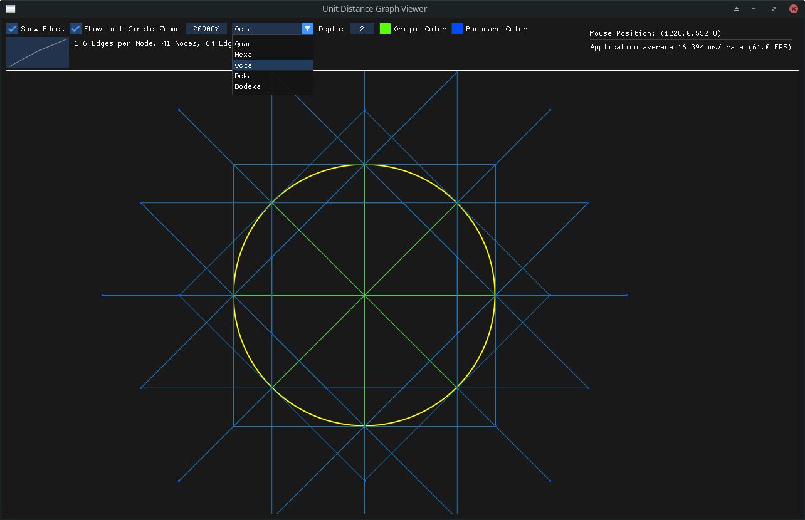
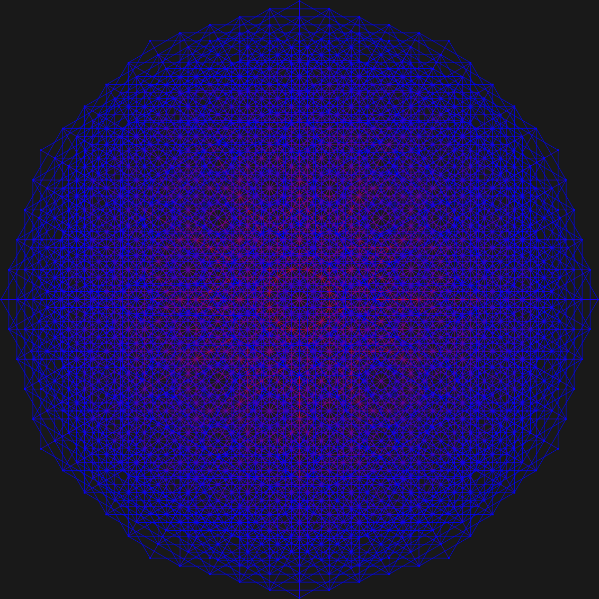

# Unit Distance Graph Viewer
Viewer for Unit Graphs constructed from a Grid


This project allows to visualize and explore unit graphs.



## Prerequisites
* SDL3
* ImGui
* Meson

## Build
```
meson build
cd build
meson compile
./unitdistancegraphviewer
```
